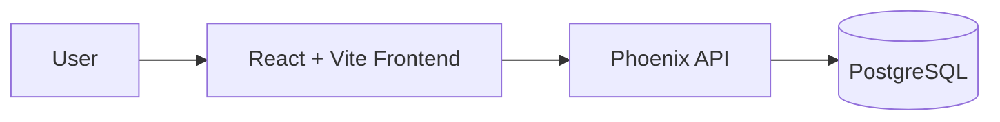

# Punchlines Online


Punchlines Online is a full-stack web application made up of:



- Elixir Phoenix backend in `backend/`
- React + Vite frontend in `frontend/`
- VS Code Dev Containers

This project is organized as a small monorepo so the API and UI can be developed and run independently while sharing the same workspace.

## Project overview

### Backend

- Elixir + Phoenix
- GraphQL API served under `/gql`
- REST health endpoint under `/api/health`
- PostgreSQL database via Ecto

### Frontend

- React
- TypeScript
- Vite dev server
- Runs locally in the browser at `http://localhost:5173`

## Prerequisites

Before starting, make sure you have:

- Docker
- VS Code
- Dev Containers extension installed
- (Optional) Node.js and npm (if you want to run the frontend outside the container)
- (Optional) Elixir 1.17+ (if you want to run the backend outside the container)

## Getting started

The easiest way to run this project is with the provided Dev Container.

### 1. Open the project in VS Code

- Open the repository root in VS Code
- Reopen the folder in the Dev Container

If the container configuration changes or dependencies need to be refreshed, rebuild it using the Command Palette (Cmd+Shift+P):

- `Dev Containers: Rebuild Container`
- `Dev Containers: Rebuild Container without Cache`

### 2. Install backend dependencies and initialize the database

From the repository root:

```bash
cd backend
mix deps.get
mix ecto.setup
```

This installs Elixir dependencies and sets up the local database.

### 3. Start the backend

```bash
cd backend
mix phx.server
```

The Phoenix app will run on:

- API: `http://localhost:4000`
- GraphQL playground: `http://localhost:4000/gql/playground`
- Health check: `http://localhost:4000/api/health`

### 4. Start the frontend

Open a second terminal and run:

```bash
cd frontend
npm install
npm run dev
```

The frontend dev server runs at:

- UI: `http://localhost:5173`

## Local development workflow

For regular development, use two terminals:

### Terminal 1: backend

```bash
cd backend
mix phx.server
```

### Terminal 2: frontend

```bash
cd frontend
npm run dev
```

This keeps the API and UI running together while you work on both sides of the app.

### Using psql

Run this inside the devcontainer:

```bash
psql -h db -p 5432 -U postgres -d backend_dev
```

When prompted, enter:

```bash
postgres
```

For the test database:

```bash
psql -h db -p 5432 -U postgres -d backend_test
```

## Useful commands

### Backend

```bash
cd backend
mix setup
mix test
mix format
mix ecto.reset
mix phx.server
```

### Frontend

```bash
cd frontend
npm install
npm run dev
npm run build
npm run lint
```

## Testing

Run backend tests with:

```bash
cd backend
MIX_ENV=test mix test
```

You can also run a specific test file, for example:

```bash
cd backend
MIX_ENV=test mix test test/backend/accounts/user_test.exs
```

## Project structure

```text
.
├── README.md
├── backend/
│   ├── lib/
│   ├── priv/
│   ├── config/
│   ├── test/
│   ├── mix.exs
│   └── README.md
├── frontend/
│   ├── src/
│   ├── public/
│   ├── package.json
│   ├── vite.config.ts
│   └── tsconfig*.json
├── .devcontainer/
├── LICENSE
└── prompts/
```

## Configuration notes

- The backend is configured for local development in the `backend/config/dev.exs` dir.
- The app expects Postgres to be available in the development environment.
  - Use `db:5432` within the Dev Container.
- The frontend uses Vite and exposes the app at port `5173`.

## Troubleshooting

### Backend cannot connect to the database

Run:

```bash
cd backend
mix ecto.create
mix ecto.migrate
```

### Frontend dependencies are missing

```bash
cd frontend
npm install
```

### Need to rebuild the dev container

Use the Command Palette (Cmd+Shift+P) `Dev Containers: Rebuild Container without Cache` command to rebuild the environment after config or Docker changes.

## Contributing

1. Create a feature branch.
2. Make focused changes.
3. Run the relevant tests.
4. Keep the README updated when setup or workflow changes.

## Notes

This project uses a typical modern stack for a web app:

- Elixir/Phoenix for the backend.
- React/Vite for the frontend.
- PostgreSQL for persistence.
- Dev Container for a consistent local environment.
